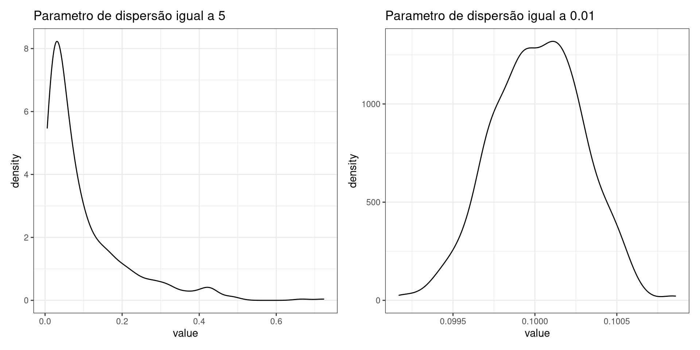

## Sumário

::: {.incremental}

<br />

- Características Básicas

<br />

 

- Aplicações

<br />


- Bibliografia

:::


# Tudo tem um começo

## Motivação 


<br />
<br />

- **Pouca existência na época de distribuições suportando dados de taxas.**

<br />

 


::: footer
Época = Anos 80
:::


## Quantidades básicas


<br />


- Se X é r.v e tem distribuição simplex (padronizada), então sua função densidade de probabilidade (pdf) é dada por:


$$f(x; \mu, \varphi)=\bigg\{\dfrac{\varphi}{2\pi x(1 - x)^{3}}\bigg\}^{\dfrac{1}{2}}\exp\bigg\{\dfrac{-\varphi(x - \mu)^2}{2x(1-x)\mu^2(1-\mu)^2}\bigg\}$$


* Onde X e $\mu$ pertencem ao intervalo (0,1) e $\varphi > 0$


<br />

* Não tem forma fechada pra Função de distribuição acumulada (fda)


---

## Quantidades Básicas

Em @barndorff1991some é demonstrado algumas propriedades básicas dada a seguir:
<br />


$$\text{E}(X) = \mu$$ 

$$\text{Var}(X) = \mu(1 - \mu) - \sqrt{\dfrac{\varphi}{2}}\exp\bigg\{\dfrac{\varphi}{\mu^2(1-\mu)^2}\bigg\}\Gamma\bigg\{\dfrac{1}{2}, \dfrac{\varphi}{2\mu^2(1-\mu^2)}\bigg\}$$


<br />

Onde $\Gamma(a,b) = \int_{b}^{\infty}t^{a-1}b^tdt$


{.absolute top=140 left=100 width="280" height="150"}


<br />


## Alguns gráficos {background-color="white"}


::: {.cell}
::: {.cell-output-display}
{width=960}
:::
:::


## Informações adicionais

Se $\varphi^2 \to 0$ então

$$\dfrac{X -\mu}{\varphi\sqrt{V(\mu)}} \to N(0,1)$$


Onde $V(\mu) = \mu^3(1-\mu)^3$

* Assim pela proposição anterior, podemos calcular a acumulada/quantil quando temos o parâmetro de precisão convergindo pra zero.

* Caso contrario usamos integração numérica.


# Aplicações (ão)

## Modelo de regressão Simplex

Seja $Y_1, Y_2,... Y_n$ variáveis aleatórias independentes onde cada uma segue uma distribuição simplex com média $\mu_t$, assim o modelo de regressão simplex fica definido como:

$$
g(\mu_t) = \sum_{i=1}^{k}x_{ti}\beta_i
$$


Em que o $g: (0,1) \to 	\mathbb{R}$ e os $\beta's$ são os parâmetros a serem estimados.

::: footer
Sim, existe uma restrição para o parâmetro de precisão/forma também
:::

## Aplicação {background-color="white"}

* *longitudinal study of decay of intraocular gas (C3F8)*


::: {.cell}

```{.r .cell-code}
library(simplexreg)
data("retinal", package = "simplexreg")
model <- simplexreg(Gas ~ LogT + LogT2 + Level | LogT + Level | Time, corr = "AR1", id = ID, data = retinal)

final_model = model |> summary()


final_model$coefficients$mean |> fastrep::tbl()
```

::: {.cell-output-display}
`````{=html}
<table class=" lightable-classic" style='font-family: "Arial Narrow", "Source Sans Pro", sans-serif; margin-left: auto; margin-right: auto;'>
<caption></caption>
 <thead>
  <tr>
   <th style="text-align:left;">   </th>
   <th style="text-align:center;"> Estimate </th>
   <th style="text-align:center;"> Std. Error </th>
   <th style="text-align:center;"> z value </th>
   <th style="text-align:center;"> Pr(&gt;|z|) </th>
  </tr>
 </thead>
<tbody>
  <tr>
   <td style="text-align:left;"> (Intercept) </td>
   <td style="text-align:center;"> 2.7214178 </td>
   <td style="text-align:center;"> 0.2027160 </td>
   <td style="text-align:center;"> 13.4247824 </td>
   <td style="text-align:center;"> 0.0000000 </td>
  </tr>
  <tr>
   <td style="text-align:left;"> LogT </td>
   <td style="text-align:center;"> 0.0339412 </td>
   <td style="text-align:center;"> 0.3119537 </td>
   <td style="text-align:center;"> 0.1088021 </td>
   <td style="text-align:center;"> 0.9133595 </td>
  </tr>
  <tr>
   <td style="text-align:left;"> LogT2 </td>
   <td style="text-align:center;"> -0.3294627 </td>
   <td style="text-align:center;"> 0.0851473 </td>
   <td style="text-align:center;"> -3.8693273 </td>
   <td style="text-align:center;"> 0.0001091 </td>
  </tr>
  <tr>
   <td style="text-align:left;"> Level </td>
   <td style="text-align:center;"> 0.4092388 </td>
   <td style="text-align:center;"> 0.2168897 </td>
   <td style="text-align:center;"> 1.8868522 </td>
   <td style="text-align:center;"> 0.0591802 </td>
  </tr>
</tbody>
</table>

`````
:::
:::

## Nem tudo tem um fim
<br />

* Sim, é possível gerar números aleatórios com a distribuição Simplex

<br />

* A distribuição Simplex tem  mais foco em regressão

<br />

* Pode ser considerado um modelo concorrente para o modelo de regressão beta


::: footer
Mas vc sabia que o artigo da regressão beta tem #input$citações???
:::

## Bibliografia

{.absolute top=370 left=100 width="100" height=290"}
